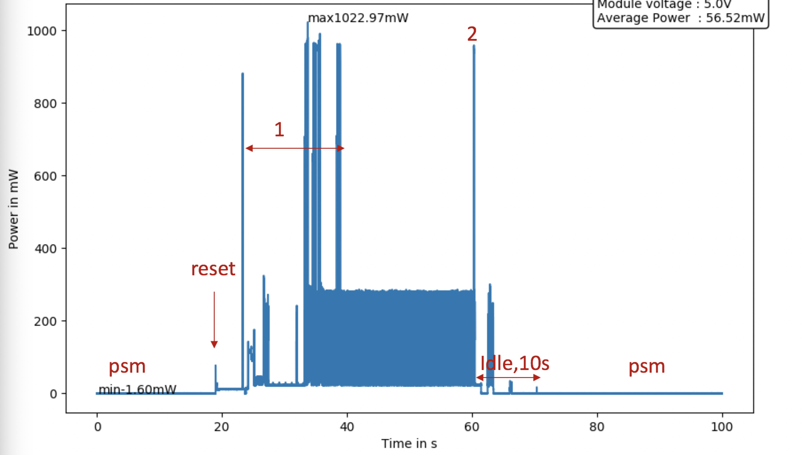

# Introduction
There are some features about CFB-609. It will make a difference on power consumption test and how to use the module.
#CFB-609
* CFB609_EVB_DX module development board is mainly used in the development and testing of YunCheng Technology Company（http://www.ccfrom.com） NBIOT module CFB609, which is convenient for users to understand NBioT technology and software control.

* YOU can get more at folder `references`
## UDP
* PROCESS
   * PSM->Create a UDP socket->Connect to IP and port->Send data->Receive data->IDLE->PSM
   * `AT+NSOCR=DGRAM,17,19010`\
     `AT+NSOST=1,115.28.215.130,1234,3,313131`\
     `AT+NSOCL=1`
   * (115.128.215.130,1234) is a server test port which will return some messages after you send data by UDP.
* RESULT

  * The part `2`consumes **42mA/1k bytes** current average according to CCFROM Technical Support.
  *  Actual test results is **30mA/25 bytes**
## TCP
* PROCESS
   * PSM->Create a TCP socket->Connect to IP and port->Send data->Close the TCP connection->IDLE->PSM
* RESULT

## PSM
* PROCESS
   * PSM->Reset->Access network->connected->Release RRC->IDLE->PSM
* RESULT

* CONCLUSION
  * CFB-609 module can be waked up from PSM by RESET button.Accessing network again is necessary after module is waked up
  * CFB-609 module can be waked up from by AT commands which is different from BC26 module.
