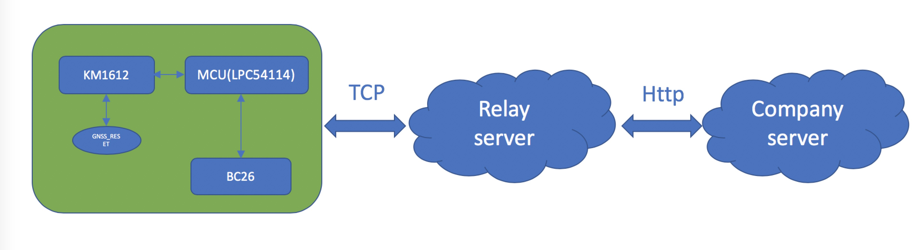

# Introduction
* This is an example of using BC26 to communicate with a server based on sensor_v01_KM1612. We can get location message on relay server(located at AWS).
* There is work flow:

* Contens
  *  listener:listen the port 49962 on relay server for a TCP connected
  * nbiot.pem:for ssh remote login
  * TCP_sensor_v01:program on LPC54114
  * figures:some reference_figures
# [What is sensor_v01_KM1612?](https://github.com/nofreegood/Work-summary/blob/master/Sensor_v01/doc/Introduction.md#sensor_v01-km1612)
