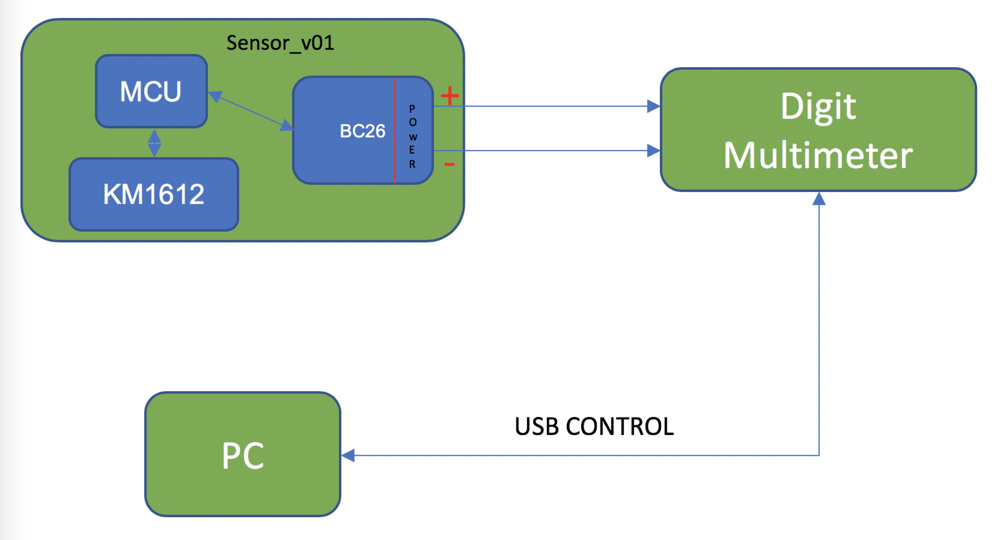

# Introduction
This document describes the power consumption of BC26 module under different conditions, which can help you quickly understand the current consumption.
* What is the power consumption of BC26 Module in PSM?
   * **Power-test-PSM**
* What is the power consumption of BC26 Module in PSM?
   * **Power-test-eDRX**
* What is the power consumption of sending one byte data in TCP?
   * **Power-test-TCP**

# Test Condition
##Test Instrument
KEITHLEY 2110 5½ Digit Multimeter\
\
*You can get support on how to ues this instrument at* *https://github.com/Kolmostar/misc-tools-for-testing/tree/master/DMM/query-usbtmc*
##Test connection

* How to connect modules?

[What is sensor_v01?]()
* VBAT_RF and VBAT_BB are power pins,power voltage is 3.6V.\

# Power-test-PSM
This section describes the results of power consumption of BC26 in PSM under different states.One is set to RAI=0, another is RAI=1.Communication protocol is UDP.\
[what is RAI?]()
## RAI=0
### PARAMETERS:
T3412=1h,T3324=30s
### PROCESS:
access network->wait->release RRC->IDLE->UDP send data->wait->release RRC->IDLE->PSM(deep sleep)
### RESULT
Average power is **29.68mW**\
Deep sleep power is **0.02mW**\
You can get test data at(../Test Data/RAI%3D0-UDP-PSM-BC26.csv).

## RAI=1
### PARAMETERS:
T3412=1h,T3324=30s
### PROCESS:
access network->wait->release RRC->IDLE->UDP send data and release RRC->IDLE->PSM(deep sleep)
### RESULT
Average power is **23.86mW**\
Deep sleep power is **0.02mW**\
You can get test data at(https://github.com/Kolmostar/NB_tracker/blob/master/power_consumption_data/RAI%3D1-UDP-PSM-BC26.csv).

## CONCLUSION
Enable RAI=1 means the second **20S WAIT** can be omitted,which saves more power. 

# Power-test-eDRX
This section is divided into three parts.Each part describes the eDRX features of BC26 under different conditions.
## Disable sleep mode
Disable sleep mode means light sleep mode and deep sleep mode are denied.
### PARAMETERS:
TeDRX=89.12s,TPTW=20s
### PROCESS:
paging-wait-paging-wait...
### RESULT
Average power is **18.43mW**\
Wait power is **18.3560mW**\
You can get test data at(https://github.com/Kolmostar/NB_tracker/blob/master/power_consumption_data/eDRX-disable%20sleep%20mode.csv).

## Light sleep mode
Light sleep mode means module can be waked up by uart or TeDRX timeout.
### PARAMETERS:
TeDRX=81.92s,TPTW=20s
### PROCESS:
paging-wait-paging-wait...
### RESULT
Average power is **0.87mW**\
Wait power is **0.7524mW**\
You can get test data at(https://github.com/Kolmostar/NB_tracker/blob/master/power_consumption_data/eDRX-light%20sleep%20mode.csv).

## Deep sleep mode
Deep sleep mode means module can only be waked up by TeDRX timeout.When **TeDRX>=168.34s**, module enters deep sleep mode automatically.
### PARAMETERS:
TeDRX=163.84s,TPTW=20s
### PROCESS:
paging->deep sleep->access network->wait->release RRC
### RESULT
Average power is **38.02mW**\
Deep sleep mode power is **0.02mW**\
You can get test data at(https://github.com/Kolmostar/NB_tracker/blob/master/power_consumption_data/eDRX-deep%20sleep%20mode.csv).

## NOTES
1. Comparing eDRX in deep sleep and PSM, we can find that the two are very similar, the difference is that the proportion of deep sleep.
2. In theory, eDRX in deep sleep consumes less energy, but in fact it consumes up to 38mw, which is much higher than eDRX in light sleep, because in deep sleep mode, when the module wakes up from deep sleep, it **may** re-access the network.**I am not sure what happened during this time**, but this behavior does consume a lot of energy.

# Power-test-TCP
This section test the power consumption of sending 1 bytes by TCP. In the same condition, send 5 bytes data by TCP firstly, then send 10 bytes data.Second power consumption minus first power consumption，then divide by 5 to get power consumption per byte by TCP.
## RESULT
Current consumption:0.826mA/byte

