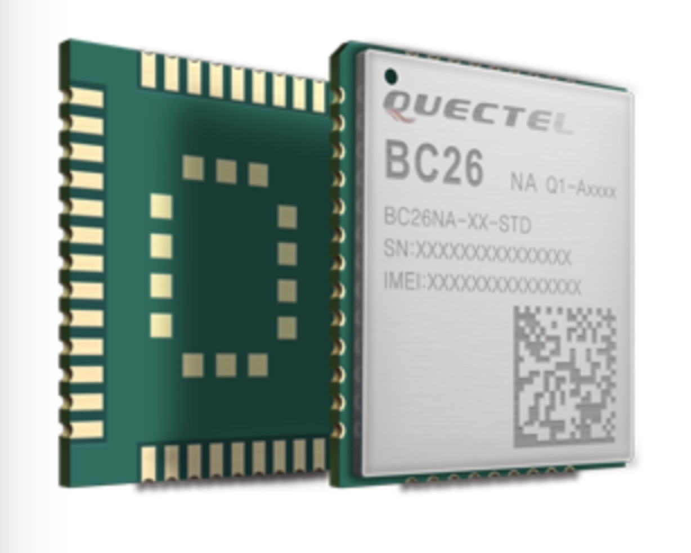
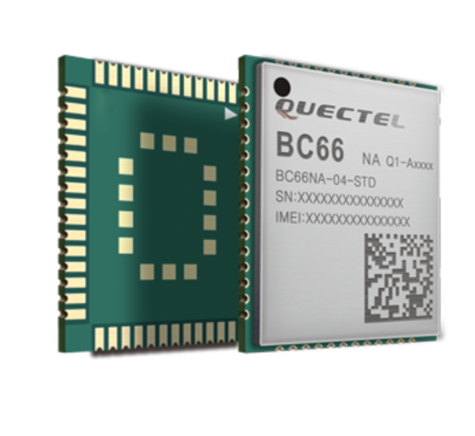

# Introduction
Quectel LTE BC26 LPWA Module is high-performance, multi-band LTE Cat NB1 module with extremely low power consumption. The ultra-compact 17.7mm × 15.8mm × 2.0mm profile makes it perfect choice for size sensitive applications. \
\
*You can get more about BC26 at https://www.quectel.com/cn/product/BC26.htm*
# Notes
**LTE BC26 LPWA Module can only be used in China.Another module LTE BC66 LPWA Module that can be used globally belongs to the same type compared with BC26.**\
\
*You can get more about BC66 at https://www.quectel.com/product/bc66.htm*

# Hardware Desgin
This document defines the BC66 module and describes its air interface and hardware interface which are
connected with the customers’ applications.
This document can help customers quickly understand module interface specifications, electrical and
mechanical details, as well as other related information of the module. Associated with application notes
and user guides, customers can use BC66 to design and set up mobile applications easily.\
*[click here-English Document about BC66](https://github.com/nofreegood/Work-summary/blob/master/LTE_BC26_LPWA%20MODULE/References/Quectel_BC66_Hardware_Design_V1.2.pdf)*\
This document also applies to BC26 Module.If you only want to get more about BC26.\
*[click here-Chinese Document about BC26](https://github.com/nofreegood/Work-summary/blob/master/LTE_BC26_LPWA%20MODULE/References/Quectel_BC26_%E7%A1%AC%E4%BB%B6%E8%AE%BE%E8%AE%A1%E6%89%8B%E5%86%8C_V1.0_Preliminary_20171206.pdf)*
