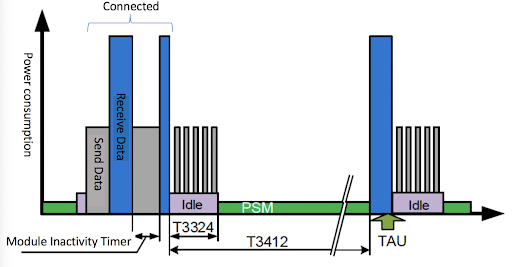
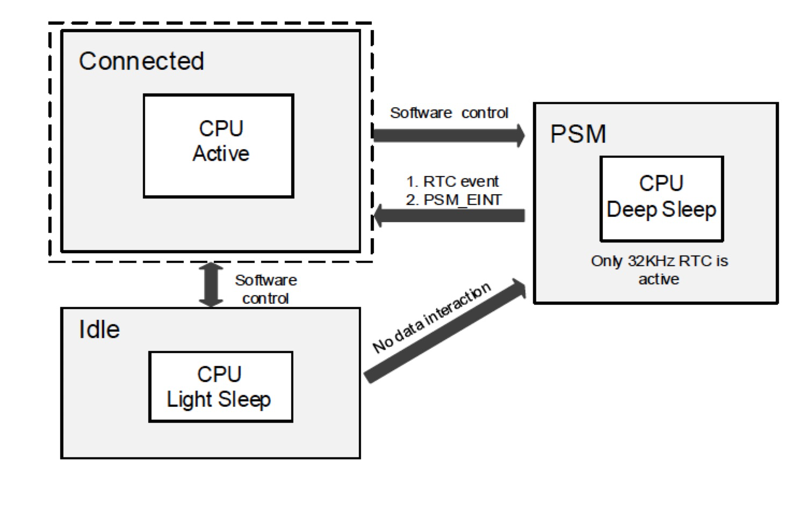

# Introduction
This part describes how to use AT commands to control BC26 module.These commands include:
* How to Enable/Disable Echo-Mode
* How to Use TCP
* How to Use UDP
* How to Use PSM
* How to Use eDRX
* How to Use Release Assistance Indication

We can combine these commands to transfer positioning data to the server based on BC26 module.\
*You can get more usages of these commands at
https://github.com/nofreegood/Work-summary/blob/master/LTE_BC26_LPWA%20MODULE/References/Quectel_BC26_AT_Commands_Manual_V1.0_Preliminary_20180125.pdf*
# How to Enable/Disable Echo-Mode
Some BC26 module will enable Echo Mode by default，which means module will echo commands you send.If you don't need this function,you can send AT commands to disable it.
## NOTES
Not all modules enable Echo Mode by default,you need to test them.It should be related to the version of BC26,but there is no further information.
## AT COMMENDS
### Disable echo mode
Send `ATE0\r\n`\
Response `\r\nok\r\n`
### Enable echo mode
Send `ATE1\r\n`\
Response `\r\nok\r\n`
# How to Use TCP
TCP is a stable way of communication, but the process is more complicated, which means more power consumption.
## NOTES
* TCP connection will prevent the module from entering deep sleep. If you want enable PSM or eDRX(TeDRX>89.12S),please close TCP connection firstly.
* The data received by the module is temporarily stored in the memory, you need to seed AT command to get it.
## AT COMMANDS
### TCP Communication
**1. Create a TCP Socket**\
Send `AT+QSOC=1,1,1\r\n`\
Response `\r\n+QSOC=0\r\n\r\nOK\r\n`

**2. TCP Connection**\
Send `AT+QSOCON=0,PORT,"IP"\r\n`\
Response `\r\nOK\r\n`

**3. Data Interaction**
* **Upload Data**\
  Send `AT+QSOSEND=0,DATA BYTES,DATA\r\n`\
  Response `\r\nOK\r\n`\
  Notes:DATA should be Hex ASCII form, eg `AT+QSOSEND=0,3,313131\r\n` means send `111`
* **Receive Data**\
  Response `\r\n+QSONMI=0,DATA BYTES/r/n`\
  Send `AT+QSORF=0,DATA BYTES\r\n`\
  Response `\r\nSocket Number,IP,PORT,DATA BYTES,DATA,Remaining Bytes/r/n`

  **eg** Server send `1111111111` to BC26\
     BC26 Response:`\r\n+QSONMI=0,10/r/n`\
     SOC Send:`AT+QSORF=0,10\r\n`\
     BC26 Response:`\r\n0,39.105.163.16,49962,10,31313131313131313131,0/r/n`

**4. Close TCP Connection**\
Send `AT+QSOCL=0\r\n`\
Response `\r\nok\r\n`
# How to Use UDP
UDP is not stable enough compared to TCP, , but UDP communication process is simpler, which means lower power consumption.
## AT COMMANDS
### UDP Communication
**1. Create a UDP Socket**\
Send `AT+QSOC=1,2,1\r\n`\
Response `\r\n+QSOC=0\r\n\r\nOK\r\n`

**2. UDP Connection**\
Send `AT+QSOCON=0,PORT,"IP"\r\n`\
Response `\r\nOK\r\n`

**3. Data Interaction**
* **Upload Data**\
  Send `AT+QSOSEND=0,DATA BYTES,DATA\r\n`\
  Response `\r\nOK\r\n`\
  Notes:DATA should be Hex ASCII form, eg `AT+QSOSEND=0,3,313131\r\n` means send `111`
* **Receive Data**\
  Response `\r\n+QSONMI=0,DATA BYTES/r/n`\
  Send `AT+QSORF=0,DATA BYTES\r\n`\
  Response `\r\nSocket Number,IP,PORT,DATA BYTES,DATA,Remaining Bytes/r/n`

  **eg** Server send `1111111111` to BC26\
     BC26 Response:`\r\n+QSONMI=0,10/r/n`\
     SOC Send:`AT+QSORF=0,10\r\n`\
     BC26 Response:`\r\n0,39.105.163.16,49962,10,31313131313131313131,0/r/n`

**4. Close UDP Connection**\
Send `AT+QSOCL=0\r\n`\
Response `\r\nok\r\n`

# How to Use PSM
This section describes the features on PSM of BC26 Module. PSM increases the proportion of deep sleep time to reduce power consumption.Users can set the period of T3412 timer and T3324 timer.\

## NOTES
* The UE can enable PSM , but the period is determined by the network side（communication operators).China Mobile can provide parameters as follow:\
**T3412**=54min-310h, the increment interval is 6 minutes.\
**T3324**=2s-62s, the increment interval is 2 seconds;2min-31min, the increment interval is 1 minute;1h-310h, the increment interval is 1 hour.
* Module in PSM can be waked up by PSM_EINT PIN or T3412 timeout.
## AT COMMANDS
### Enable PSM
Send `AT+CPSMS=1,,,"T3412","T3324"\r\n`\
Response `\r\nOK\r\n`\
**Comment**\
`T3412` is a Periodic-TAU string type. One byte in an 8-bit format. \
Bits 5 to 1 represent the binary coded timer value\
Bits 6 to 8 define the timer value unit as follows:\
0 0 0 value is incremented in multiples of 10 minutes\
0 0 1 value is incremented in multiples of 1 hour\
0 1 0 value is incremented in multiples of 10 hours\
0 1 1 value is incremented in multiples of 2 seconds\
1 0 0 value is incremented in multiples of 30 seconds\
1 0 1 value is incremented in multiples of 1 minute\
1 1 0 value is incremented in multiples of 320 hours\
1 1 1 value indicates that the timer is deactivated\
(e.g. "00100100" equals 4 hours).

`T3324` is a Active-Time string type. One byte in an 8-bit format. \
Bits 5 to 1 represent the binary coded timer value.\
Bits 6 to 8 defines the timer value unit for the GPRS timer as follows:\
0 0 0 value is incremented in multiples of 2 seconds\
0 0 1 value is incremented in multiples of 1 minute\
0 1 0 value is incremented in multiples of decihours\
1 1 1 value indicates that the timer is deactivated\
(e.g. "00100100" equals 4 minutes).

### Disable PSM
Send `AT+CPSMS=0\r\n`\
Response `\r\nOK\r\n`
### PSM Network Registration State
Check the periods of T3412 and T3324 whether register successful.

Send `AT+CEREG=5\r\n`\
Response `\r\nOK\r\n`\
Send `AT+CEREG?\r\n`\
Response `\r\n+CEREG: <stat>,<lac>,<ci>,<AcT>,<cause_type>,<reject_cause>,<Active-T
ime>,<Periodic-RAU>\r\n`

**Comment**\
`<stat>` Integer type. The EPS registration status.\
0 Not registered, MT is not currently searching an operator to register to\
1 Registered, home network\
2 Not registered, but MT is currently trying to attach or searching an operator to register to\
3 Registration denied\
4 Unknown (e.g. out of E-UTRAN coverage)\
5 Registered, roaming\
`<tac>` String type. Two bytes tracking area code in hexadecimal format (e.g. “00C3” equals 195 in
decimal).\
`<ci>` String type. Four bytes E-UTRAN cell ID in hexadecimal format.\
`<AcT>` Integer type. Access technology of the registered network.\
7 E-UTRAN\
9 E-UTRAN (NB-S1 mode)\
`<cause_type>` Integer type. The type of <reject_cause>.\
0 Indicates that <reject_cause> contains an EMM cause value (see 3GPP TS
24.008[8] Annex G).\
1 Indicates that <reject_cause> contains a manufacturer-specific cause value\
`<reject_cause>` Integer type. Contains the cause of the failed registration. The value is of type as
defined by <cause_type>.\
`Active-Time` equal `T3324`\
`Periodic-RAU` equal `T3412`
# How to Use eDRX
This part describes the features on eDRX mode of BC26.  decreases the proportion of connect time to reduce power consumption.Users can set the period of TeDRX timer and TPTW timer.\

## NOTES
* The UE can enable eDRX , but the period is determined by the network side（communication operators).**China Mobile** can provide parameters as follow:\
**TeDRX**=20.48s-2.91h\
**TPTW**=20.48s\
* Module in eDRX mode(TeDRX<=89.12s) can be waked up by UART or TeDRX timeout.If TeDRX>89.12s，module will enter deep sleep automatically, which means module can only be waked up by TeDRX timeout.
## AT COMMANDS
### Enable eDRX
Send `AT+CEDRX=1,5,"REQUEST_TeDRX"\r\n`\
Response `\r\nOK\r\n`\
**Comment**\
`"TeDRX",` String type. Half a byte in a 4-bit format. \
Bits 1 to 4 define the timer value unit as follows:\
0 0 1 0 20.48 seconds\
0 0 1 1 40.96 seconds\
0 1 0 1 81.92 seconds\
1 0 0 1 163.84 seconds\
1 0 1 0 327.68 seconds\
1 0 1 1 655.36 seconds\
1 1 0 0 1310.72 seconds\
1 1 0 1 2621.44 seconds\
1 1 1 0 5242.88 seconds\
1 1 1 1 10485.76 seconds

### Disable eDRX
Send `AT+CEDRX=0\r\n`\
Response `\r\nOK\r\n`
### eDRX Network Registration State
Check the periods of TeDRX and TPTW whether register successful.

Send `AT+CEDRXRDP\r\n`\
Response `\r\n+CEDRXRDP:<AcT-type>,<Requested_eDRX_value>,<NW-provided_eDRX_value>,<Paging_time_window>\r\n`

**Comment**\
`<AcT-type>` Integer type. The type of access technology. AT+CEDRXS? is used to specify the
relationship between the type of access technology and the requested eDRX value.\
0 Access technology is not using eDRX. This parameter value is only used in
the unsolicited result code\
5 E-UTRAN (NB-S1 mode)\
`<Requested_eDRX_value>` String type. Half a byte in a 4-bit format.\
bit\
4 3 2 1 E-UTRAN eDRX cycle length duration\
0 0 1 0 20.48 seconds\
0 0 1 1 40.96 seconds\
0 1 0 1 81.92 seconds\
1 0 0 1 163.84 seconds\
1 0 1 0 327.68 seconds\
1 0 1 1 655.36 seconds\
1 1 0 0 1310.72 seconds\
1 1 0 1 2621.44 seconds\
1 1 1 0 5242.88 seconds\
1 1 1 1 10485.76 seconds\
`<NW-provided_eDRX_value>` String type. Half a byte in a 4-bit format.\
bit\
4 3 2 1 E-UTRAN eDRX cycle length duration\
0 0 1 0 20.48 seconds\
0 0 1 1 40.96 seconds\
0 1 0 1 81.92 seconds\
1 0 0 1 163.84 seconds\
1 0 1 0 327.68 seconds\
1 0 1 1 655.36 seconds\
1 1 0 0 1310.72 seconds\
1 1 0 1 2621.44 seconds\
1 1 1 0 5242.88 seconds\
1 1 1 1 10485.76 seconds\
`<Paging_time_window>` String type. Half a byte in a 4-bit format.\
bit\
4 3 2 1 Paging Time Window length\
0 0 0 0 2.56 seconds\
0 0 0 1 5.12 seconds\
0 0 1 0 7.68 seconds\
0 0 1 1 10.24 seconds\
0 1 0 0 12.8 seconds\
0 1 0 1 15.36 seconds\
0 1 1 0 17.92 seconds\
0 1 1 1 20.48 seconds\
1 0 0 0 23.04 seconds\
1 0 0 1 25.6 seconds\
1 0 1 0 28.16 seconds\
1 0 1 1 30.72 seconds\
1 1 0 0 33.28 seconds\
1 1 0 1 35.84 seconds\
1 1 1 0 38.4 seconds\
1 1 1 1 40.96 seconds\
**China Mobile can only provide 20.48s**
# How to Use Release Assistance Indication
This section describes the functions of the RAI（Release Assistance Indication）.In some cases, you can use this to save power.Note the **module inactivity timer** in the follow figure, which means if module keep inactivity for a while then module will release RRC(Radio resource Control).In the current NB-iot network, the inactivity interval is depended on network instead of UE(User Equipment),which will consume extra power.We can change it by RAI.\

## AT COMMANDS
Send `AT+QNBIOTRAI=<rai>\r\n`\
Response `\r\nOK\r\n`\

**Comment**\
`<rai>` Integer type. Specifies release assistance information\
0 No information available (or none of the other options apply)\
1 TE will send only 1 UL packet and no DL packets expected.It means that the terminal sends an uplink data, and does not expect to have a downlink packet, such as the UDP protocol. After the uplink is sent, the RRC is released.\
2 TE will send only 1 UL packet and only 1 DL packet expected.If the terminal sends an uplink and has a downlink ACK packet, the RRC will be released immediately after receiving the downlink packet.\

**For example**, PING; if such a scenario uses parameter 1, it will be released immediately after the uplink transmission is completed, but because the network needs to reply the ACK to the terminal, the network will page the terminal again to re-establish the RRC connection.
