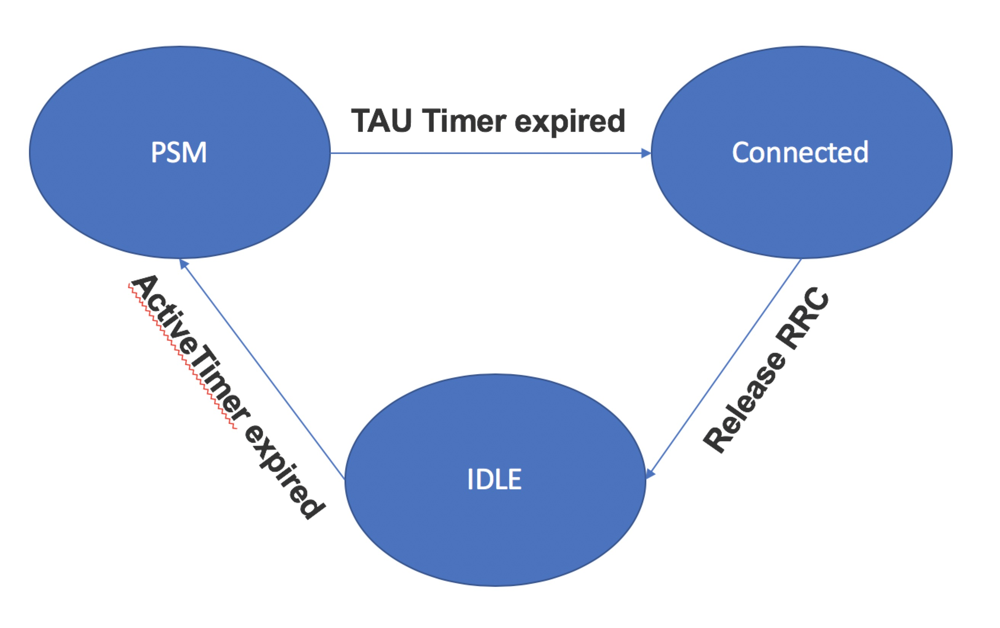

# What is Narrowband IoT?
Narrowband IoT (also known as NB-IoT or LTE-M2) is an LPWAN technology which doesn’t operate in the licensed LTE construct. Instead, it works in one of three ways:

* Independently
* In unused 200-kHz bands that have previously been used for GSM (Global System for Mobile Communications)
* On LTE base stations allocating a resource block to NB-IoT operations or in their guard bands.

Telecommunication giants such as Huawei, Ericsson, Qualcomm, and Vodafone have collectively put together this standard in conjunction with 3GPP. Huawei, Ericsson, and Qualcomm are interested in NB-IoT because it has a number of benefits.

# Business Benefits
1. Power Efficiency\
Efficiently powering IoT devices is critical. Think about it: who wants to be out there changing the batteries on 20 billion devices every six months? While nearly all IoT technologies are developed to save power when they aren’t operating, they do draw energy when the modem is running and handling signal processing.

2. Cost Savings\
Technologies with simpler waveform — like NB-IoT — will consume less power. A 200 kHz NB-IoT frontend and digitizer offers reduced complexity of analog-to-digital (A/D) and digital-to-analog (D/A) conversion, buffering, and channel estimation. Power savings = cost savings. Plus, NB-IoT chips are simpler to create and thus come cheaper.

3. Reliability\
Rolling out NB-IoT on a licensed spectrum means improved reliability for users as well as the guaranteed resource allocation needed for managed Quality of Service (QoS).

4. Wider Deployment\
Compared to LTE-M1, NB-IoT has lower bitrates and better link budgets. Additionally, per Huawei’s Emmanuel Coehlo Alves in an IoT Hub article, NB-IoT doesn’t need gateways to provide connectivity.Instead of “creating another piece of equipment you need to manage and operate,” he said, NB-IoT can directly connect sensors to the base station. This will boost flexibility while lowering costs.

5. Global Reach\
While heavy hitters in the U.S. have already invested billions into LTE networks, there are many areas around the world with less LTE, even though pilots and network rollouts are in full swing. Outside of the U.S., there are larger GSM deployments on which to find unused bands to leverage for NB-IoT. NB-IoT then could help IoT innovators find affordable entry points in new markets globally.
Even in the U.S., smaller carriers such as Sprint or T-Mobile might also deploy NB-IoT on existing GSM spectrum to expand connectivity without the LTE investment of a Verizon or AT&T.

# How to save power?
There are two modes to saving power in NB-IOT,called PSM and eDRX.
## Definition of PSM
PSM has been introduced in 3GPP Rel.12 as solutions to optimize the device power consumption.PSM means power saving mode.
## Features of PSM
* In PSM mode, device enters into power saving state in which it reduces power consumption to a bare minimum.  
* In the power saving state, mobile does not monitor paging. Hence it becomes unreachable for mobile terminated call (MTC) services. This mode is beyond typical IDLE mode in which mobile performs certain tasks e.g. monitors neighbor cells , maintains reachability etc.  
* The device leaves PSM mode when trigger comes from upper layers for MO (Mobile Originated) access for tasks such as uplink data transfer, TAU (Tracking Area Update), RAU (Routing Area Update) etc.  
* After MO access and data transfer is completed, device using PSM mode starts active timer. Here device remains reachable for MT (Mobile Terminated) traffic by monitoring paging channel until active timer expires. After the timer expires device re-enters PSM mode and hence unreachable until the next MO event.

## Advantages of PSM
* Instead of turning OFF the device, PSM supports MT reachability via RAU or TAU.  
* In PSM mode, device stays registered in the network and maintains connection configurations.  
* When leaving PSM mode due to MO event, it is not needed to first attach to the network in order to setup connection. This reduces signaling overhead and optimizes power consumption consecutively.
## State machine of PSM

## Definition of eDRX
eDRX has been introduced in 3GPP Rel.13 as solutions to optimize the device power consumption.eDRX means extend Discontinuous Reception.
## Features of eDRX
* The basic principle for eDRX is to extend DRX cycles in order to allow device to remain longer in power saving state between "Paging Occasions". This will consecutively minimize its energy consumption.

## Advantage of eDRX
* Device remains periodically available for MT services.  
* Moreover it is not required first to perform RAU or TAU to trigger limited period of reachability.
## Summary on PSM and eDRX
* From the above analysis, whether it is PSM or eDRX, it can be seen as increasing the proportion of deep sleep time to reduce power consumption, actually sacrificing real-time requirements. In comparison, eDRX has less power saving effect, but it is better in real time.  
* The UE can enable PSM or eDRX , but which one or both are turned on, and the period **is determined by the network side（communication operators）**.  
* PSM and eDRX can be used to adapt to different scenarios. For example, eDRX may be more suitable for pet tracking, and PSM is more suitable for smart meter reading.

# NB-IoT Applications
NB-IoT applications can cross many service categories. These include:

* Smart metering (electricity, gas, and water)
* Facility management services
* Intruder and fire alarms for homes & commercial properties
* Connected personal appliances measuring health parameters
* Tracking of persons, animals or objects
* Smart city infrastructures such as street lamps or dustbins
* Connected industrial appliances such as welding machines or air compressors.

**You can find more about NB-iot at**
* [What is Narrowband IoT?](https://5g.co.uk/guides/what-is-narrowband-iot/)
* [Huawei_NB-IOT-Enabling New Business Opportunities](https://github.com/nofreegood/Work-summary/blob/master/NB-IOT/References/Huawei_NB-IOT-Enabling%20New%20Business%20Opportunities.pdf)
