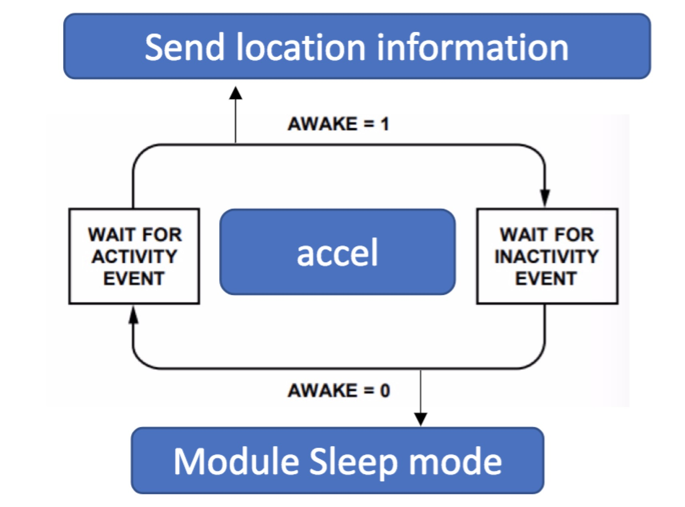
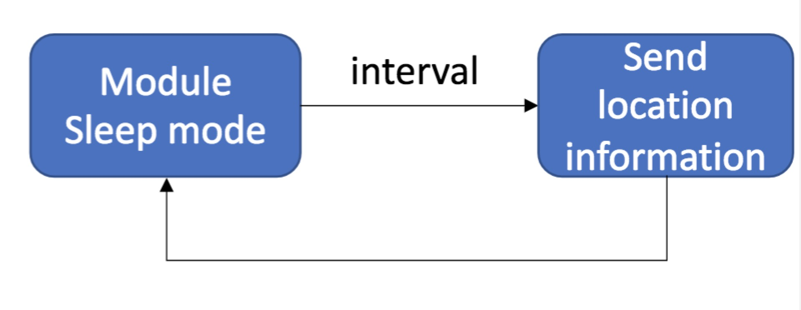

# Introduction
Based on sensor_v01_ublox-M8N,this part provide a example about how to use accelerometer to control system and how to use RTC TIMING to control system,which are called real-time mode and timing mode.\
[what is sensor_v01_ublox-M8N?](https://github.com/nofreegood/Work-summary/blob/master/Sensor_v01/doc/Introduction.md#sensor_v01-ublox_m8n)
* Real-time mode: The system starts the accelerometer and continuously uploads the positioning information (determined by the rate at which Ublox uploads the positioning information). If the system detects that the system is stationary for a period of time, the system stops uploading the positioning information, and the MCU enters the sleep mode; if the system is detected again Movement, the system is awakened by the interrupt generated by the accelerometer, uploading the positioning information again

* Timing mode: The system requests input timing interval after power-on, and then uploads positioning information every time interval.

