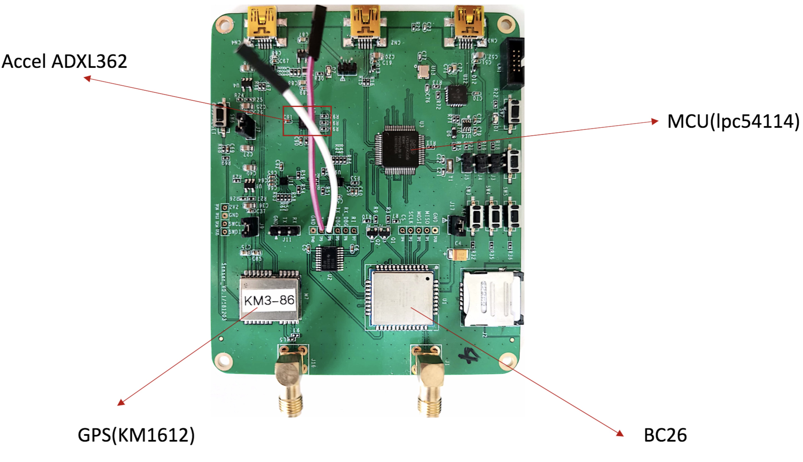
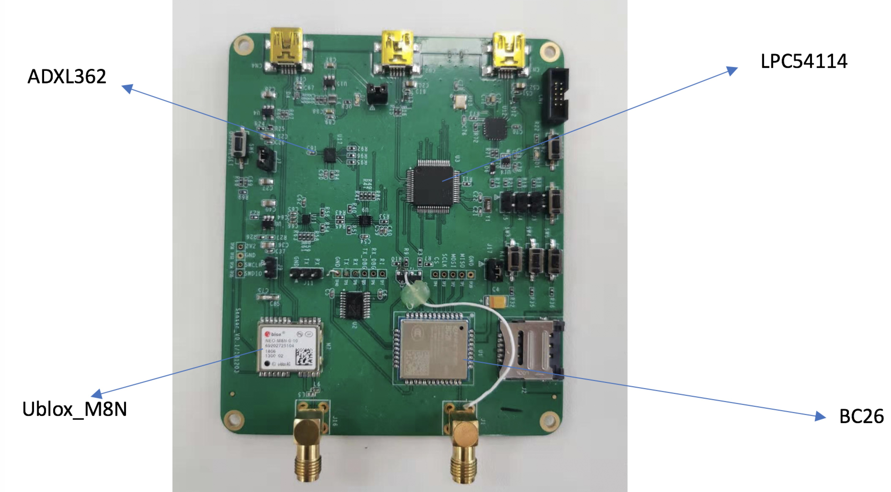

# What is sensor_v01?
sensor_v01 is a NB_Tracker_evk, which integrates with NB-IoT communication module BC26, accelerometer module ADXL362, GNSS module KM1612 OR Ublox M8N.\
[sensor_v01 circuit diagram](https://github.com/nofreegood/Work-summary/blob/master/Sensor_v01/References/sensor_v0.1%20.pdf)
# Sensor_v01-KM1612

[KM1612 circuit diagram](https://github.com/nofreegood/Work-summary/blob/master/Sensor_v01/References/km1612_evk-v01.pdf)\
[Introduction on BC26 Module](https://github.com/nofreegood/Work-summary/tree/master/LTE_BC26_LPWA%20MODULE/doc)\
[Introduction on ADXL362](https://github.com/nofreegood/Work-summary/blob/master/Sensor_v01/References/ADXL362.pdf)
# Sensor_v01-Ublox_M8N

[Introduction on Ublox_M8N](https://github.com/nofreegood/Work-summary/blob/master/Sensor_v01/References/NEO-M8-FW3_DataSheet_(UBX-15031086).pdf)
